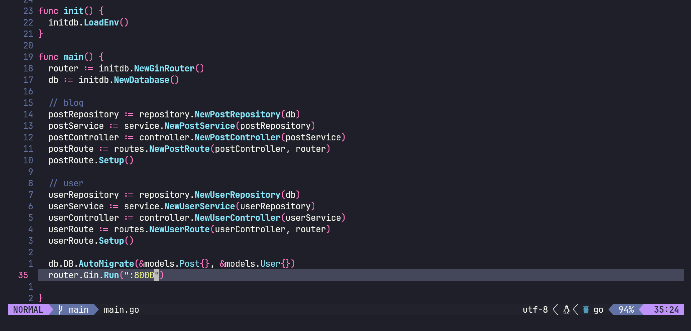

# Divetech Blog

> A Rest APIs for blog post with fully functionality backend services.
> Implemented Gin Framework to build Rest APIs.

## Table of Contents

- [Requirements](#requirements)
- [Features](#features)
- [Screenshots](#screenshots)
- [Setup](#setup)
- [Endpoint](#endpoint)
- [Project Status](#project-status)
- [Room for Improvement](#room-for-improvement)
- [Contact](#contact)

## Requirements

- Go Installed   - version 1.21.4
- Docker 	     - version 23.0.3
- Docker-compose - version 3.8.0
- Prefarrably Linux Machine

## Features

- Perform CRUD operation to MySQL database using gorm ORM.
- Save, FindAll, FindByID, Update and delete a Post.
- User APIs and Authentication using JWT token.
- Save data using MySQL in Docker.
- Implementation of backend features in Gin framework.

## Screenshots



## Setup

To run this project, build it using docker-compose:

```bash
$ cd ../divetech-blog
$ docker-compose up --build
```

## Endpoint

### Blog
- Get All Post endpoint -> /posts/
- Get Post endpoint -> /posts/1
- Create Post endpoint -> /posts/
- Update Post endpoint -> /posts/2
- Delete Post endpoint -> /posts/3

### User
- Register endpoint -> /auth/register
- Login endpoint -> /auth/login

Open [http://localhost:8000/posts](http://localhost:8000/posts) with your browser to see all data.

## Project Status

Project is: _on progress._ <!-- / _complete_ / _no longer being worked on_. reason ? -->

## Room for Improvement

- Adding user to blog.
- Rest APIs of related user posts.

## Contact

Created by [@Zulhaditya](https://zulhaditya.vercel.app/) - feel free to contact me!
